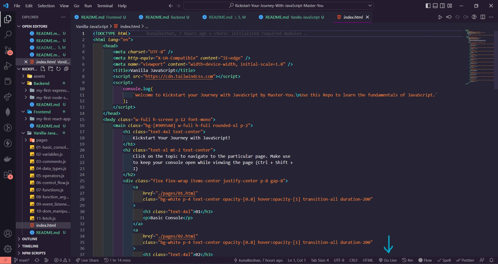
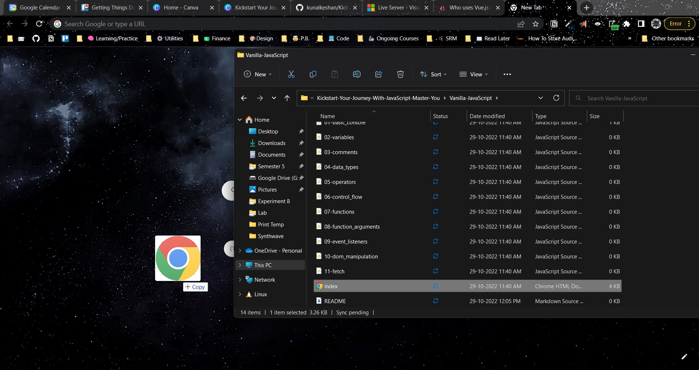
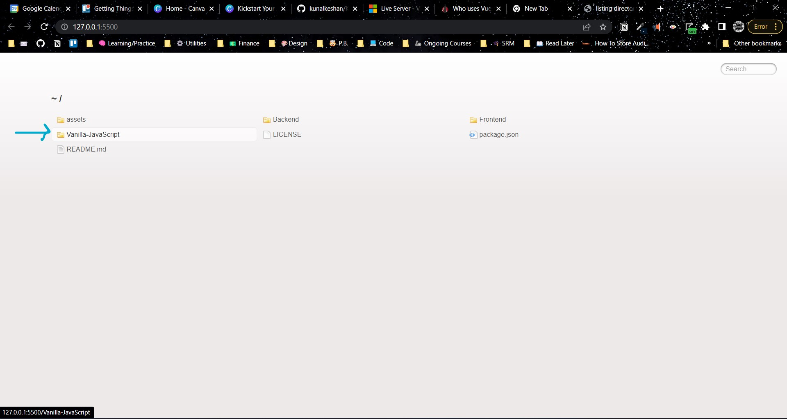

# Kickstart Your Journey With JavaScript - Master-You by Think-Digital

<p align="center">
    
</p>

Explore the various facets of how JavaScript rules the world of web...

## 📥 Prerequisites

Before we get started, make sure you've installed the following:

- Node.js - [https://nodejs.org/en/download/](https://nodejs.org/en/download/) (Recommended)
- VS Code - [https://code.visualstudio.com/download](https://code.visualstudio.com/download) (Optional)
  - Live Server Extension - [https://marketplace.visualstudio.com/items?itemName=ritwickdey.LiveServer](https://marketplace.visualstudio.com/items?itemName=ritwickdey.LiveServer) (Optional)

## 🚀 Getting Started

### Clone this Repository

```bash
git clone https://github.com/kunalkeshan/Kickstart-Your-Journey-With-JavaScript-Master-You.git
```

This Repo is split into three parts, **Vanilla JavaScript**, **Frontend JS - React.js**, **Backend JS - Node.js and Express.js**.

### 1️⃣ Learn Fundamentals of JavaScript

Navigate to the [Vanilla-JavaScript](./Vanilla-JavaScript) folder and you can access the basic concepts of JavaScript from each file with the `.js` extension. Over here there are two ways you can learn the basics,

- From the Browser (Install the Live Server Extension mentioned above)
- From your Terminal (Install Node.js mentioned above)

#### From the browser

- Hopefully, you're using VS Code here and have installed the Live Server Extension. Simply click on `Go Live` and navigate to the `Vanilla-JavaScript` folder in the browser.
- If you've not installed it, it's not an issue, simple drag and drop the `index.html` file in the `Vanilla-JavaScript` folder to get started or open the file using a browser.

| Using VS Code | Drag and Drop |
| --- | --- |
|  |  |
|  | |

From here on you can check the topics resources and how the code actually works for each topic.

#### From your Terminal

- Open the Command Line Prompt of use the VS Code Terminal and run the following commands to see each topic output in your terminal directly.
- Make sure that you're having the file open for proper understanding.
- Refer to the [README.MD](./Vanilla-JavaScript/README.md) of the `Vanilla-JavaScript` folder for more directions.

Eg:

```bash
npm run 01
```

Expected Output:

```bash
Hello, World!
```

### 2️⃣ Learn Frontend Framework - React.js

In this part of the project, we simply explore frontend frameworks, namely `React.js`.

- Navigate to the [Frontend](./Frontend) folder and read the [README.md](./Frontend/README.md) file for further instructions.

### 3️⃣ Learn Backend - Node.js and Express.js

In this section of the project, we explore how Node.js can be used to create backend application, and how we can use external libraries to help develop them faster and more effectively.

- Navigate to the [Backend](./Backend) folder and read the [README.md](./Backend/README.md) file for further instructions.
