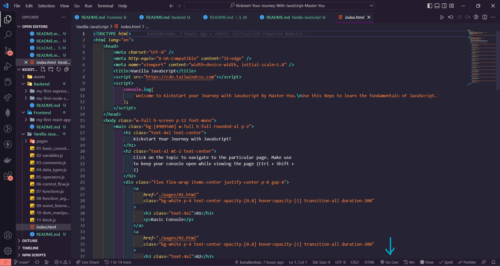
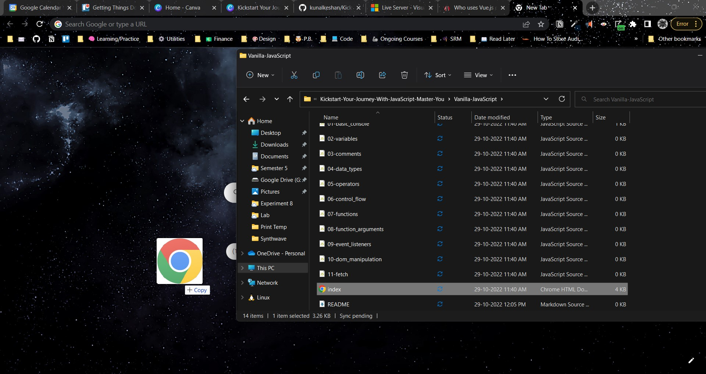

# Vanilla JavaScript

Over here there are two ways you can learn the basics,

- From the Browser (Install the Live Server Extension mentioned above)
- From your Terminal (Install Node.js mentioned above)

## 💻 From the browser

- Hopefully, you're using VS Code here and have installed the Live Server Extension. Simply click on `Go Live` and navigate to the `Vanilla-JavaScript` folder in the browser.
- If you've not installed it, it's not an issue, simple drag and drop the `index.html` file in the `Vanilla-JavaScript` folder to get started or open the file using a browser.

| Using VS Code | Drag and Drop |
| --- | --- |
|  |  |
|  | |

From here on you can check the topics resources and how the code actually works for each topic.

## ⬛ From your Terminal

- Open the Command Line Prompt of use the VS Code Terminal and run the following commands to see each topic output in your terminal directly.
- Make sure that you're having the file open for proper understanding.

## 📃 Topics

### Basic Console

- JavaScript file - [01-basic_console.js](./01-basic_console.js)
- HTML File (open in browser) - [01.html](./pages/01.html)

#### Run from your Terminal

```bash
npm run 01
```

#### Resources

- [https://developer.mozilla.org/en-US/docs/Learn/Getting_started_with_the_web/JavaScript_basics](https://developer.mozilla.org/en-US/docs/Learn/Getting_started_with_the_web/JavaScript_basics)
- [https://www.w3schools.com/js/js_statements.asp](https://www.w3schools.com/js/js_statements.asp)

### Variables

#### Run from your Terminal

```bash
npm run 02
```

#### Resources

- [https://developer.mozilla.org/en-US/docs/Learn/JavaScript/First_steps/Variables](https://developer.mozilla.org/en-US/docs/Learn/JavaScript/First_steps/Variables)
- [https://www.w3schools.com/js/js_variables.asp](https://www.w3schools.com/js/js_variables.asp)

### Comments

#### Run from your Terminal

```bash
npm run 03
```

#### Resources

- [https://developer.mozilla.org/en-US/docs/Web/JavaScript/Guide/Grammar_and_types#comments](https://developer.mozilla.org/en-US/docs/Web/JavaScript/Guide/Grammar_and_types#comments)
- [https://www.w3schools.com/js/js_comments.asp](https://www.w3schools.com/js/js_comments.asp)

### Data Types

#### Run from your Terminal

```bash
npm run 04
```

#### Resources

- [https://developer.mozilla.org/en-US/docs/Web/JavaScript/Data_structures](https://developer.mozilla.org/en-US/docs/Web/JavaScript/Data_structures)
- [https://www.w3schools.com/js/js_datatypes.asp](https://www.w3schools.com/js/js_datatypes.asp)

### Operators

#### Run from your Terminal

```bash
npm run 05
```

#### Resources

### Control Flow

#### Run from your Terminal

```bash
npm run 06
```

#### Resources

### Functions

#### Run from your Terminal

```bash
npm run 07
```

#### Resources

### Function Arguments

#### Run from your Terminal

```bash
npm run 08
```

#### Resources

### Event Listeners

#### Run from your Terminal

```bash
npm run 09
```

#### Resources

### DOM Manipulation

#### Run from your Terminal

```bash
npm run 10
```

#### Resources

### Fetch API

#### Run from your Terminal

```bash
npm run 11
```

#### Resources
